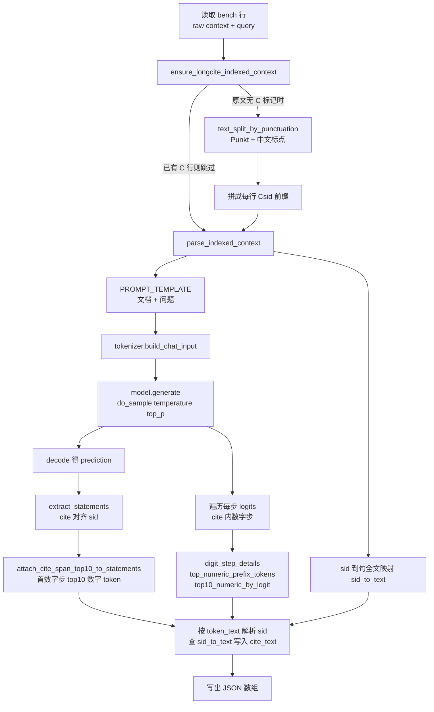

```mermaid
flowchart TD
  A[读取 bench 行<br/>raw context + query] --> B[ensure_longcite_indexed_context]
  B -->|原文无 C 标记时| B1[text_split_by_punctuation<br/>Punkt + 中文标点]
  B1 --> B2[拼成每行 Csid 前缀]
  B -->|已有 C 行则跳过| C[parse_indexed_context]
  B2 --> C
  C --> D[sid 到句全文映射 sid_to_text]
  C --> E[PROMPT_TEMPLATE<br/>文档 + 问题]
  E --> F[tokenizer.build_chat_input]
  F --> G[model.generate<br/>do_sample temperature top_p]
  G --> H[decode 得 prediction]
  H --> I[extract_statements<br/>cite 对齐 sid]
  I --> J[attach_cite_span_top10_to_statements<br/>首数字步 top10 数字 token]
  G --> K[遍历每步 logits<br/>cite 内数字步]
  K --> L[digit_step_details<br/>top_numeric_prefix_tokens<br/>top10_numeric_by_logit]
  J --> M[后处理 enrich]
  L --> M
  D --> M[按 token_text 解析 sid<br/>查 sid_to_text 写入 cite_text]
  M --> N[写出 JSON 数组]
```
