# Banzhaf-Cite：基于单通道支持度图的 LongCite 实时引用修正方案
---

## 0. 方法目标

LongCite 已经能生成带 `<statement>...</statement>` 和 `<cite>[a-b]</cite>` 的回答，但引用可能存在三类问题：

| 类型 | 问题 | 修正目标 |
|---|---|---|
| A 类 | 多个候选句协同才能完整支持 statement | 找到最小多句证据联盟 |
| B 类 | 候选集中已有关键句，但模型选错句或边界错 | 找到最关键单句或少数句 |
| C 类 | 候选中仍无足够证据，或 statement overclaim | 不强行修，删除/改写/补检索 |

Banzhaf-Cite 的目标不是重新生成完整答案，而是在 **当前 statement 的 citation 已经生成完毕、即将生成下一个 statement 时**，对这个 statement 进行实时引用修正。

总体思想：

```text
AU/logit 风险检测
→ statement-level candidate union
→ claim units
→ 单通道支持矩阵 A
→ CNN + Self-Attention 预测头
→ Banzhaf marginal / interaction
→ 最小证据联盟搜索
→ citation repair / 删除 statement
```

---

## 1. 总体框架图

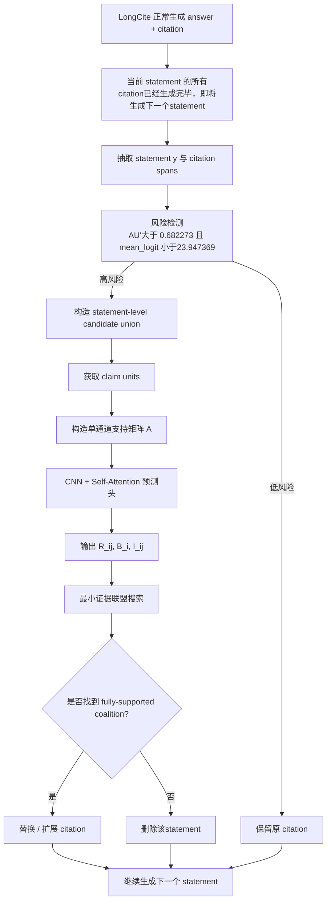

---

## 2. 输入与输出定义

### 2.1 LongCite 原始输出

给定当前 statement：

\[
y=\text{statement}
\]

LongCite 原始生成的引用跨度为：

\[
\mathcal{S}^{gen}=\{[a_1,b_1],[a_2,b_2],\ldots,[a_m,b_m]\}
\]

每个 citation span 的首数字位置都有一组候选数字 token logits。

---

### 2.2 Banzhaf-Cite 输出

对每个高风险 statement 输出：

```json
{
  "dataset": "...",
  "idx": 0,
  "statement_id": 0,
  "statement": "...",
  "risk_trigger": {
    "au_prime": 0.0,
    "mean_logit": 0.0,
    "empty_cite": false
  },
  "repair_type": "A|B|C|LOW_RISK",
  "original_citations": [[1, 1]],
  "selected_evidence": [
    {"sid": 10, "text": "...", "score": 0.91}
  ],
  "new_citations": [[10, 10]],
  "minimality_check": true,
  "action": "replace_citation|extend_citation|delete_statement|keep_original"
}
```

---

## 3. 风险检测模块

### 3.1 触发条件

对当前 statement 的每个 citation span 计算：

\[
AU'_r,\quad mean\_logit_r
\]

若存在任意 span 满足：

\[
AU'_r > 0.682273
\]

且：

\[
mean\_logit_r < 23.947369
\]

则该 statement 进入修正池。

此外，如果该 statement 不是首/尾句但 citation 为空，也进入修正池。

形式化写作：

\[
\mathbb{I}_{repair}(y)=
\mathbb{I}\left[
\exists r,\ AU'_r>0.682273\land mean\_logit_r<23.947369
\right]
\lor
\mathbb{I}[empty\_cite(y)\land not\_boundary\_statement(y)]
\]

---

### 3.2 风险检测图

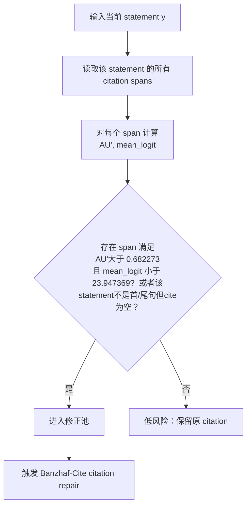

---

## 4. generation logits 与 teacher-forcing logits 分工

### 4.1 关键判断

目前发现：

- generation 阶段保存的是经过 `temperature` 和 `top_p` 处理后的 logits；
- teacher-forcing 阶段保存的是处理前 raw logits。

这是合理的，因为二者服务不同目的。

| 用途 | 使用 logits | 原因 |
|---|---|---|
| AU' / mean_logit 风险检测 | generation processed logits | 反映真实生成时进入概率竞争圈的 token |
| top-20 候选补召回 | teacher-forcing raw logits | 保留更多未被 top_p 截断的候选证据 |

### 4.2 Mermaid 图

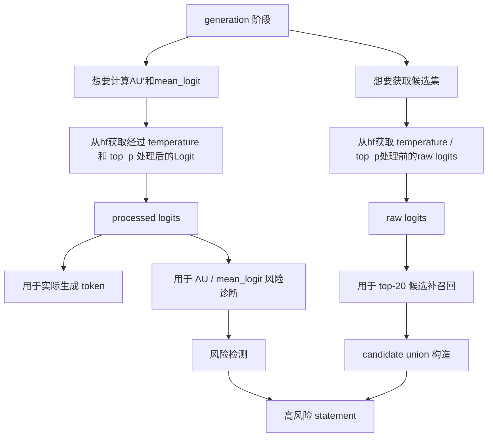

---

## 5. statement-level candidate union 模块

### 5.1 逻辑

对于高风险 statement \(y\)，假设其已经生成了 \(m\) 个 citation spans。

对每个 span 的跨度起始位置 raw logits 取 top-20：

\[
C_r^{20}=\{e_1^{(r)},e_2^{(r)},\ldots,e_{20}^{(r)}\}
\]

然后对同一个 statement 的所有 span 候选取 union：

\[
U_y=\bigcup_{r=1}^{m}C_r^{20}
\]

去重后：

\[
U_y=\{e_1,e_2,\ldots,e_n\}
\]

每个候选证据单元保留：

```text
sid
text
logit
rank
span_id
```

候选句按文档 `sid` 排序，而不是按 logit 排序。

原因：CNN 需要利用相邻句局部结构，例如 `[18-19]`。

### 5.2 Mermaid 图

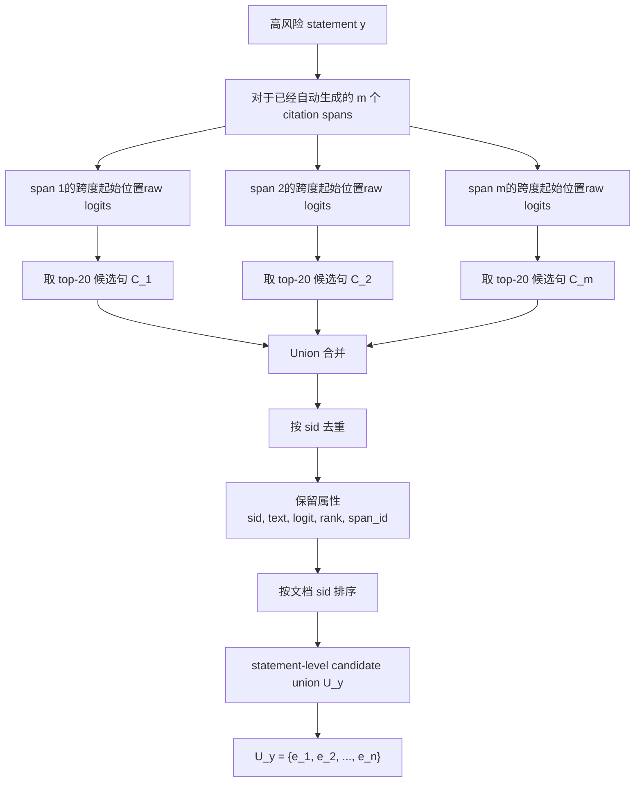

---

## 6. claim units 获取模块

### 6.1 目标

statement 往往不是单一事实，而是多个子声明的组合。

例如：

```text
STS records dI/dV spectra, proportional to LDOS, at defect sites and along nanotube axis.
```

可以拆成：

```text
q1 = STS records dI/dV spectra
q2 = dI/dV is proportional to LDOS
q3 = measurement is at defect sites
q4 = measurement is along nanotube axis
```

因此需要把 statement 表示为：

\[
Q_y=\{q_1,q_2,\ldots,q_k\}
\]

### 6.2 TMM-style Claim Aggregation

输入文本陈述 \(y\)，通过文本编码器得到：

\[
T_w^s\in\mathbb{R}^{M\times D}
\]

然后经过：

1. 1D Conv：增强相邻 token 局部语义；
2. DPC-KNN：把 token 聚成语义簇；
3. 加权中心：获得 cluster center；
4. cluster center 作为 query；
5. 1D Conv 后 token 作为 key/value；
6. cluster-aware attention 聚合；
7. 输出 claim units。

公式：

\[
\tilde{X}^q=\operatorname{Conv1D}(X^q)
\]

\[
\mathcal{C}^q=\{C_1^q,C_2^q,\ldots,C_{N_q}^q\}
\]

\[
Q_l=\tilde{x}_{c_l}W_Q
\]

\[
K_m=\tilde{x}_mW_K,\quad V_m=\tilde{x}_mW_V
\]

\[
q_l=
\sum_{m=1}^{M}
\operatorname{Softmax}\left(
\frac{Q_lK_m^\top}{\sqrt d}+W_{lm}
\right)V_m
\]

其中：

\[
W_{lm}=
\lambda_1\mathbf{1}[m\in C_l^q]
+
\lambda_2\operatorname{Imp}(x_m)
+
\lambda_3\operatorname{Boundary}(x_m)
\]

最终：

\[
Q_y=\{q_1,\ldots,q_k\}\in\mathbb{R}^{k\times D}
\]

### 6.3 Mermaid 图

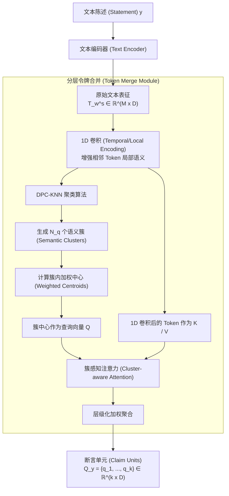

---

## 7. 单通道初始支持矩阵

### 7.1 语义相似度

候选句向量：

\[
h_i=Enc(e_i)
\]

claim unit 向量：

\[
u_j=Enc(q_j)
\]

余弦相似度：

\[
s_{ij}=\frac{\cos(h_i,u_j)+1}{2}
\]

其中：

\[
s_{ij}\in[0,1]
\]

---

### 7.2 每个 span 内 logit 归一化

对第 \(r\) 个 span 的 top-20 候选 logits：

\[
\{z_1^{(r)},z_2^{(r)},\ldots,z_{20}^{(r)}\}
\]

做 min-max 归一化：

\[
\tilde{z}_{i}^{(r)}=
\frac{
z_i^{(r)}-\min_{e_t\in C_r} z_t^{(r)}
}{
\max_{e_t\in C_r}z_t^{(r)}-
\min_{e_t\in C_r}z_t^{(r)}+
\epsilon
}
\]

若同一候选句出现在多个 span 中，取最大值：

\[
\tilde{z}_i=
\max_{r:e_i\in C_r}
\tilde{z}_{i}^{(r)}
\]

这里不使用 noisy-or，避免泛化背景句因反复出现而被过度抬高。

---

### 7.3 单通道融合公式

最终输入矩阵：

\[
A_{ij}=\alpha s_{ij}+(1-\alpha)\tilde{z}_i
\]

展开为：

\[
A_{ij}=
\alpha\cdot
\frac{\cos(Enc(e_i),Enc(q_j))+1}{2}
+
(1-\alpha)\cdot
\max_{r:e_i\in C_r}
\operatorname{Norm}_{C_r}(z_i^{(r)})
\]

推荐：

\[
\alpha=0.7\sim0.8
\]

原因：logit 只是 citation generation prior，不是证据支持分数。

---

### 7.4 Mermaid 图

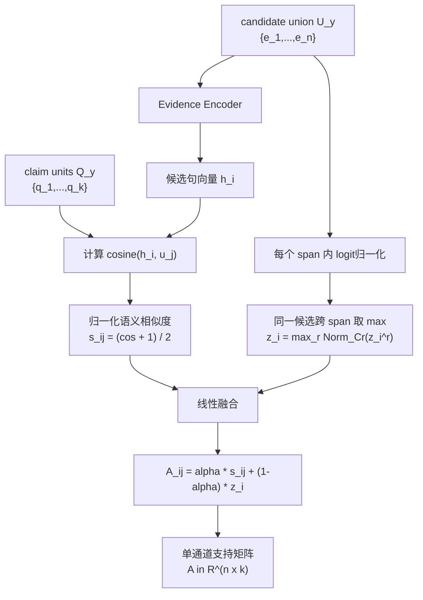

---

## 8. 单通道支持矩阵的语义

\[
A\in\mathbb{R}^{n\times k}
\]

- 行：candidate evidence units；
- 列：statement claim units；
- 值：候选句对 claim 的初始支持度。

### B 类模式

若某一行对多数 claim 都高：

\[
\exists e_i,\quad A_{ij}\text{ 对多数 }q_j\text{ 都高}
\]

说明单句可能就能支持 statement。

### A 类模式

若多行分别覆盖不同 claim：

\[
A_{i_1,j_1}\text{ 高},\quad
A_{i_2,j_2}\text{ 高},\quad
A_{i_3,j_3}\text{ 高}
\]

说明需要多证据联盟。

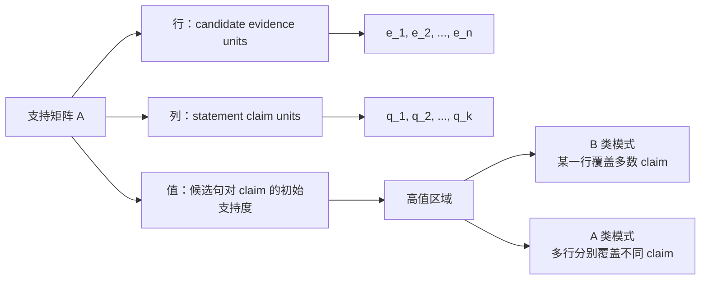

---

## 9. CNN + Self-Attention 预测头

### 9.1 输入

单通道矩阵：

\[
A\in\mathbb{R}^{n\times k}
\]

实际输入模型时加 channel 维度：

\[
A\in\mathbb{R}^{1\times n\times k}
\]

---

### 9.2 CNN 局部模式提取

\[
H=\operatorname{CNN}(A)
\]

建议卷积核：

\[
3\times3,\quad 3\times1,\quad 1\times3
\]

含义：

- \(3\times1\)：捕捉相邻候选句是否共同支持同一 claim；
- \(1\times3\)：捕捉单句是否覆盖多个 claim；
- \(3\times3\)：捕捉局部 evidence-claim 对齐块。

---

### 9.3 Candidate-level pooling

对 claim 维度池化：

\[
z_i=\operatorname{Pool}_j(H_{ij})
\]

得到：

\[
Z=[z_1,z_2,\ldots,z_n]
\]

---

### 9.4 Self-Attention over candidates

\[
Z'=\operatorname{SA}(Z)
\]

SA 用于建模候选句之间的：

- 冗余；
- 互补；
- 替代；
- 跨位置协同。

---

### 9.5 输出头

#### evidence-claim relation map

\[
R_{ij}=\sigma(W_RH_{ij})
\]

表示候选句 \(e_i\) 是否支持 claim unit \(q_j\)。

#### singleton contribution

\[
\hat{B}_i=W_Bz'_i
\]

用于修 B 类。

#### pairwise interaction

\[
\hat{I}_{ij}=MLP([z'_i;z'_j;z'_i\odot z'_j;|z'_i-z'_j|])
\]

用于修 A 类。

#### support head

对候选联盟 \(S\)：

\[
\hat{\phi}_y(S)=MLP(Pool(\{z'_i:e_i\in S\}))
\]

判断联盟是否 fully support statement。

### 9.6 Mermaid 图

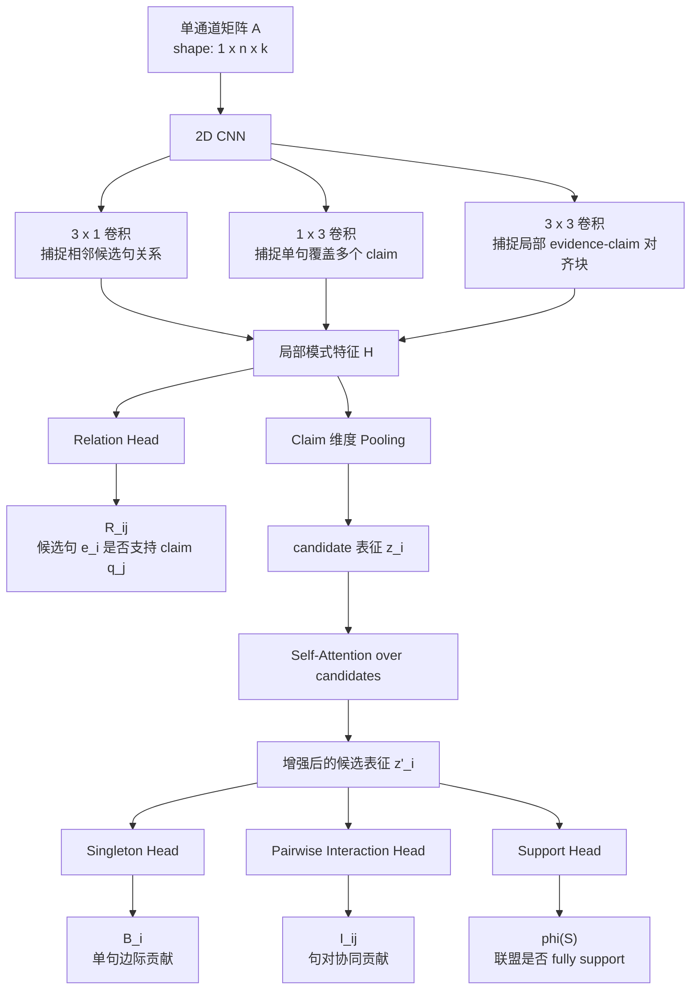

---

## 10. Banzhaf 伪标签设计

训练阶段使用 verifier 计算 Banzhaf 伪标签。推理阶段不再暴力枚举，而由 CNN+SA 预测。

### 10.1 characteristic function

\[
\phi_y(S)=Verifier(y,concat(S))
\]

其中：

\[
S\subseteq U_y
\]

\(\phi_y(S)\) 表示证据集合 \(S\) 对 statement \(y\) 的支持度。

可以离散化：

\[
No=0,\quad Partial=0.5,\quad Full=1
\]

也可以使用：

\[
P(FullSupport\mid y,S)
\]

---

### 10.2 Singleton Banzhaf contribution

\[
B_i=
\mathbb{E}_{C\subseteq U_y\setminus\{e_i\}}
[
\phi_y(C\cup\{e_i\})-\phi_y(C)
]
\]

采样近似：

\[
\hat{B}_i=
\frac{1}{M}
\sum_{m=1}^{M}
[
\phi_y(C_m\cup\{e_i\})-\phi_y(C_m)
]
\]

用于判断单句关键性。

---

### 10.3 Pairwise Banzhaf Interaction

\[
I_{ij}=
\mathbb{E}_{C\subseteq U_y\setminus\{e_i,e_j\}}
[
\phi_y(C\cup\{e_i,e_j\})
+
\phi_y(C)
-
\phi_y(C\cup\{e_i\})
-
\phi_y(C\cup\{e_j\})
]
\]

采样近似：

\[
\hat{I}_{ij}=
\frac{1}{M}
\sum_{m=1}^{M}
[
\phi_y(C_m\cup\{e_i,e_j\})
+
\phi_y(C_m)
-
\phi_y(C_m\cup\{e_i\})
-
\phi_y(C_m\cup\{e_j\})
]
\]

如果 \(I_{ij}>0\)，说明两个候选句具有正协同，而不是纯冗余。

---

### 10.4 Mermaid 图

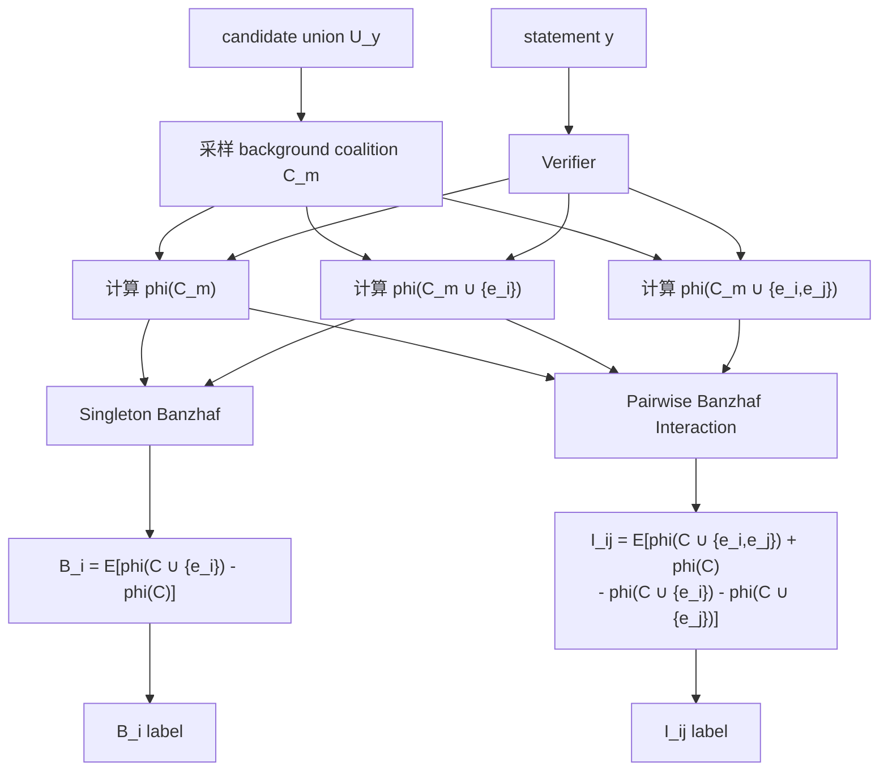

---

## 11. 训练模块

### 11.1 预测量

模型预测：

\[
R_{ij}^{pred},\quad B_i^{pred},\quad I_{ij}^{pred},\quad \phi^{pred}(S)
\]

伪标签：

\[
R_{ij}^{label},\quad B_i^{label},\quad I_{ij}^{label},\quad \phi^{label}(S)
\]

### 11.2 损失函数

\[
\mathcal{L}=
\lambda_1\mathcal{L}_{rel}
+
\lambda_2\mathcal{L}_{B}
+
\lambda_3\mathcal{L}_{I}
+
\lambda_4\mathcal{L}_{support}
+
\lambda_5\mathcal{L}_{KL}
\]

其中：

\[
\mathcal{L}_{rel}=BCE(R_{ij}^{pred},R_{ij}^{label})
\]

\[
\mathcal{L}_{B}=MSE(B_i^{pred},B_i^{label})
\]

\[
\mathcal{L}_{I}=MSE(I_{ij}^{pred},I_{ij}^{label})
\]

可选 KL 分布对齐：

\[
\mathcal{L}_{KL}^{B}=
KL(softmax(B^{pred})\parallel softmax(B^{label}))
\]

\[
\mathcal{L}_{KL}^{I}=
KL(softmax(I^{pred})\parallel softmax(I^{label}))
\]

### 11.3 Mermaid 图

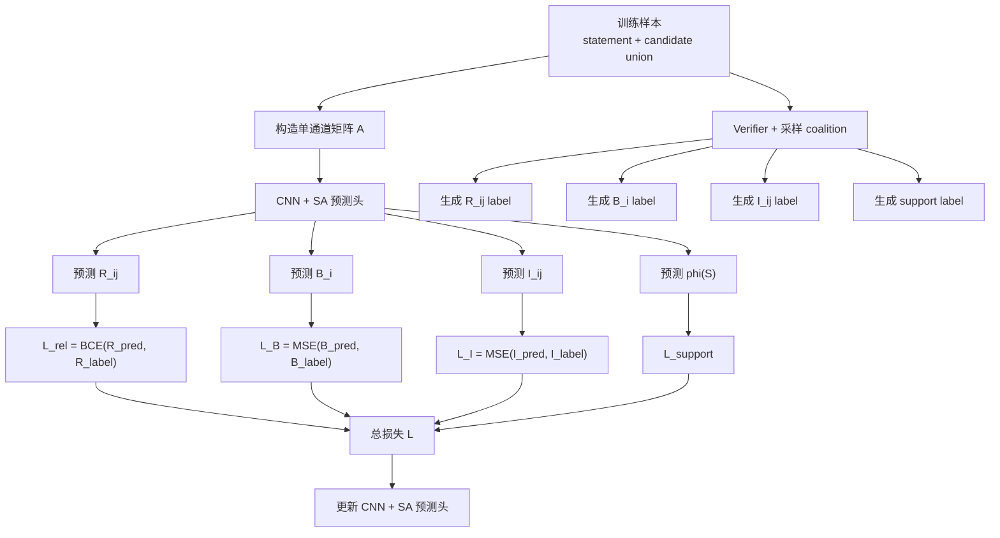

---

## 12. 推理阶段：最小证据联盟搜索

### 12.1 先修 B 类

如果存在单句 \(e_i\)：

\[
\hat{\phi}_y(\{e_i\})\geq\tau_{full}
\]

或：

\[
\hat{B}_i\text{ 很高且 coverage 足够}
\]

则：

\[
S^*=\{e_i\}
\]

判为 B 类修复。

---

### 12.2 再修 A 类

如果没有单句能 fully support，则选择 pairwise interaction 高的句对：

\[
(i,j)=\arg\max \hat{I}_{ij}
\]

要求：

\[
\hat{I}_{ij}>0
\]

若：

\[
\hat{\phi}_y(\{e_i,e_j\})\geq\tau_{full}
\]

则：

\[
S^*=\{e_i,e_j\}
\]

否则使用 beam search 扩展：

\[
S_{t+1}=S_t\cup\{e_k\}
\]

其中：

\[
e_k=
\arg\max_{e\notin S_t}
[
\hat{\phi}_y(S_t\cup\{e\})-
\hat{\phi}_y(S_t)
+
\lambda\sum_{e_i\in S_t}\hat{I}_{ik}
-
\rho Redundancy(e,S_t)
]
\]

限制：

\[
|S|\leq K_{max}
\]

建议：

\[
K_{max}=3\sim4
\]

---

### 12.3 C 类

若找不到：

\[
\exists S,\ |S|\leq K_{max},\quad \hat{\phi}_y(S)\geq\tau_{full}
\]

则判为 C 类：

```text
candidate absent / statement overclaim
```

执行：

```text
删除 statement / 改写 statement / 补检索
```

当前方案中按你的设定：**删除该 statement**。

---

### 12.4 Mermaid 图

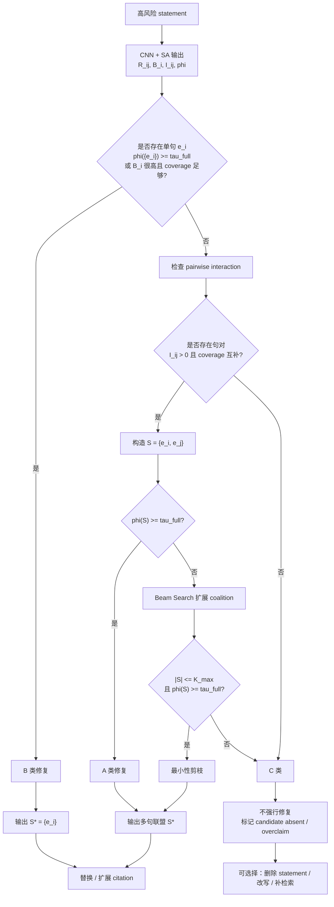

---

## 13. 最小性剪枝

得到候选联盟 \(S\) 后，检查每个证据句是否必要。

对每个 \(e_i\in S\)：

\[
\text{if }\hat{\phi}_y(S\setminus\{e_i\})\geq\tau_{full},\quad remove\ e_i
\]

最终要求：

\[
\forall e_i\in S^*,\quad
\hat{\phi}_y(S^*\setminus\{e_i\})<\tau_{full}
\]

### Mermaid 图

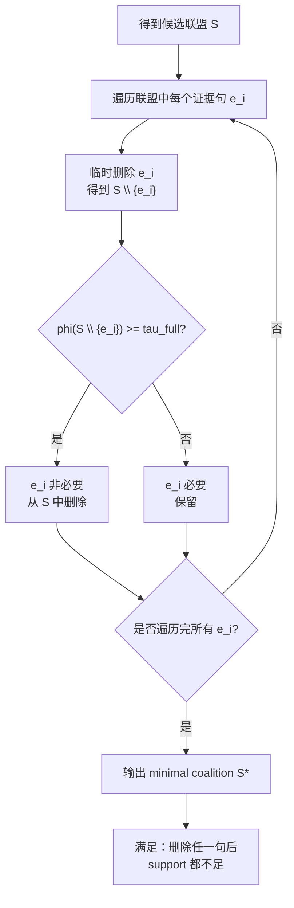

---

## 14. 与 LongCite 实时生成流程集成

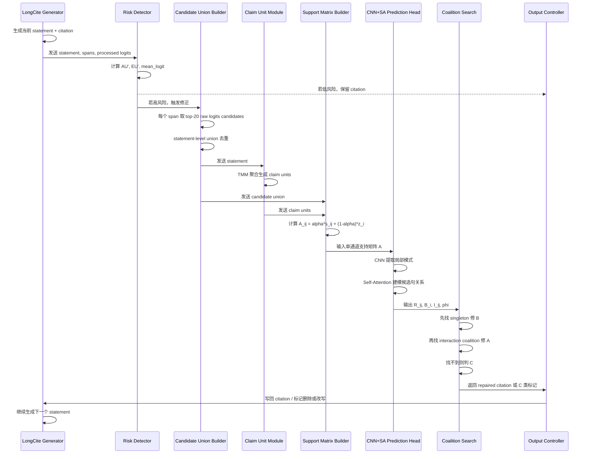

---

## 15. Cursor 实现建议目录

```text
Banzhaf_cite/
  README.md
  configs/
    Banzhaf_cite.yaml
  data/
    parse_longcite_output.py
    build_candidate_union.py
    normalize_logits.py
    split_claim_units.py
    build_support_matrix.py
  models/
    claim_unit_tmm.py
    support_matrix_encoder.py
    cnn_sa_prediction_head.py
  banzhaf/
    verifier.py
    sample_coalitions.py
    compute_banzhaf_labels.py
  repair/
    coalition_search.py
    minimality_pruning.py
    rewrite_citations.py
  train/
    train_prediction_head.py
    dataset.py
    losses.py
  eval/
    eval_citation_quality.py
    eval_repair_by_type.py
  scripts/
    run_repair_mvp.py
    run_train_head.py
    run_eval.py
```

---

## 16. MVP 实现顺序

### Stage 1：不训练预测头，先验证思路

1. 解析 LongCite 输出；
2. 根据 AU' 和 mean_logit 找高风险 statement；
3. 每个 span 取 raw logits top-20；
4. 构造 statement-level candidate union；
5. 获取 claim units；
6. 构造单通道矩阵 \(A\)；
7. 用 GPT-4o / 本地 verifier 直接计算：
   - \(\phi_y(\{e_i\})\)
   - \(\phi_y(\{e_i,e_j\})\)
   - 近似 \(B_i\)、\(I_{ij}\)
8. 做最小联盟搜索；
9. 改 citation；
10. 重新 judge。

### Stage 2：训练 CNN+SA prediction head

1. 用 Stage 1 生成的 verifier / Banzhaf 结果做伪标签；
2. 训练 CNN+SA 输入 \(A\)，输出 \(R_{ij},B_i,I_{ij}\)；
3. 推理时用 prediction head 替代大量 verifier 调用。

### Stage 3：实时集成 LongCite

1. generation 时保存 processed logits；
2. 触发风险检测；
3. 高风险 statement 调 repair；
4. 输出修正 citation 或删除 statement；
5. 继续生成。

---

## 17. 实验设计

### 17.1 Baselines

1. Original LongCite；
2. top-logit candidate；
3. cosine-only rerank；
4. logit-only rerank；
5. \(\alpha s+(1-\alpha)z\) 单通道 rerank；
6. NLI singleton rerank；
7. naive top-k concatenate；
8. Banzhaf-Cite without interaction；
9. Banzhaf-Cite full。

### 17.2 消融实验

#### 融合权重

\[
\alpha\in\{0.5,0.6,0.7,0.8,0.9\}
\]

预期：

- \(\alpha\) 太低：logit 噪声过强；
- \(\alpha\) 太高：忽略 LongCite 自身生成偏好；
- 最优可能在 \(0.7\sim0.8\)。

#### 候选来源

比较：

\[
C^{gen},\quad C^{tf},\quad C^{gen}\cup C^{tf}
\]

#### union 口径

比较：

- single-span candidates；
- statement-level candidate union。

#### interaction 口径

比较：

- singleton only；
- singleton + pairwise interaction；
- singleton + pairwise + beam search。

---

## 18. 评估指标

引用质量：

\[
Citation\ Precision
\]

\[
Citation\ Recall
\]

\[
Citation\ F1
\]

statement 支持：

\[
Support\ Score
\]

错误率：

\[
Irrelevant\ Citation\ Rate
\]

\[
Out\text{-}of\text{-}range\ Rate
\]

引用长度：

\[
Average\ Citation\ Length
\]

最小性：

\[
Minimality\ Rate=
\frac{
\#\{S^*: \forall e\in S^*,\phi(S^*\setminus e)<\tau_{full}\}
}{
\#\{S^*\}
}
\]

分类型评估：

- Type A repair success；
- Type B repair success；
- Type C rejection / deletion accuracy。

---

## 19. 核心边界条件

1. **logit 不是语义支持分数**  
   它只能作为 citation generation prior。

2. **不使用距离衰减**  
   正确证据不一定在原始错误引用附近。

3. **AU/EU 用 generation processed logits**  
   因为它们要解释真实生成时的选择难度和决策信心。

4. **teacher-forcing raw logits 用于补候选**  
   它适合提高 candidate recall，但不能和 processed logits 混尺度。

5. **B 和 A 分开处理**  
   B 用 singleton marginal；A 用 pairwise interaction + beam search。

6. **C 不强行修**  
   找不到 fully-supported coalition 时，应删除/改写/补检索，而不是堆长引用。

---

## 20. 一句话总结

Banzhaf-Cite 用 AU' 和 mean_logit 发现 LongCite 引用不稳定的 statement，用 raw logits top-20 构造 statement-level candidate union，用 claim units 和候选句构造单通道支持度矩阵 \(A_{ij}=\alpha s_{ij}+(1-\alpha)\tilde z_i\)，再用 CNN+SA 预测 Banzhaf marginal 与 interaction，最终用最小证据联盟修复 A/B 类引用错误；找不到联盟的 C 类 statement 则删除或改写。
