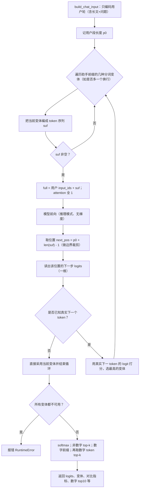
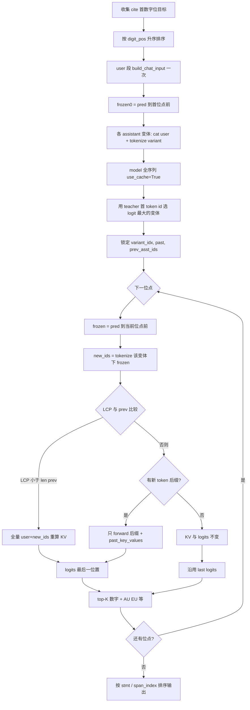

引文生成本质上是概率寻址，通过Teacher-forcing技术，可以回溯模型在生成每一个引文数字瞬间的心理状态（Logits/概率分布）。
先把评测用的长文档（按句子编号后的版本）和问题拼成模型在正式推理时看到的那一整段用户输入，并得到对应的 token序列；再拿模型当时已经生成好的整段回答文本，一直截到某个引用里句首编号第一个数字出现之前（相当于引用方括号已经写好、数字还没写出来），把这一截作为已生成的前缀直接接在用户输入后面，并在序列末尾读出下一个 token的打分，再从中挑出十个数字相关 token的原始得分，作为该引用位置处模型当时的数字偏好。

# Teacher-force 增量 KV：按 `digit_pos` 全局排序

同一篇 `prediction` 内，所有 cite 首数字位先按字符位置 `digit_pos` 升序遍历；在首轮锁定 assistant 的换行变体后，后续步尽量只把**相对上一步多出来的** assistant token 前向进模型，并复用 `past_key_values`。在**最后一个新 token** 处取 `logits[0, -1]` 作为「下一 token」分布。

要点：

- **单调 `digit_pos`** 保证 `frozen` 字符串只变长，多数步下 `new_ids` 是 `prev_asst_ids` 的**延长**，只需增量一段 `chunk`。
- **`LCP < len(prev)`**：新 token 序列无法接在旧 cache 后（常见于跨 token 边界的字符增长），必须 **user+assistant 全量** 重算 cache。
- **首轮变体**：与原先 `_next_token_logits_after_frozen` 一致，用 teacher 的 `target_next_token_id` 在变体间打分，避免 chat template 下「是否 leading `\n`」歧义。
